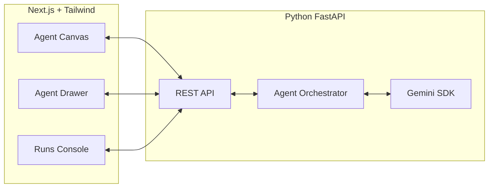

# System Architecture

## Overview

The system consists of a Next.js frontend and a Python FastAPI backend, communicating via REST APIs and WebSocket/SSE for real-time updates.

## Architecture Diagram



## Frontend Architecture

### Next.js App Router Structure

```
frontend/
├── app/
│   ├── (lab)/
│   │   ├── page.tsx          # Main canvas view
│   │   └── layout.tsx
│   ├── api/                  # Next.js API routes (if needed)
│   └── layout.tsx
├── components/
│   ├── canvas/
│   │   ├── AgentNode.tsx
│   │   ├── AgentCanvas.tsx
│   │   └── ConnectionHandle.tsx
│   ├── drawer/
│   │   ├── AgentDrawer.tsx
│   │   └── PromptEditor.tsx
│   ├── console/
│   │   └── RunsConsole.tsx
│   └── library/
│       └── TemplatesLibrary.tsx
├── lib/
│   ├── api.ts                # API client
│   ├── store.ts              # Zustand store
│   └── types.ts              # TypeScript types
└── hooks/
    └── useAgentExecution.ts
```

### Key Frontend Components

- **Agent Canvas**: Interactive graph visualization using React Flow
  - Renders agent nodes as draggable entities
  - Handles connection creation between nodes
  - Manages canvas zoom/pan/minimap

- **Agent Drawer**: Side panel for editing agent properties
  - Name, role, system prompt editor
  - Tools selection
  - Parameters (temperature, max tokens)
  - Test prompt button

- **Runs Console**: Execution monitoring panel
  - Start/stop execution controls
  - Live log streaming
  - Output display

### State Management

- **Zustand Store**: Global state for:
  - Agent graph (nodes and edges)
  - Selected agent
  - Active runs
  - Templates and tools

## Backend Architecture

### FastAPI Structure

```
backend/
├── main.py                   # FastAPI app entry
├── api/
│   ├── routes/
│   │   ├── agents.py
│   │   ├── links.py
│   │   ├── runs.py
│   │   └── templates.py
│   └── middleware.py
├── core/
│   ├── orchestrator.py       # Agent graph execution
│   ├── gemini_client.py      # Gemini API wrapper
│   └── models.py             # Pydantic models
├── db/
│   ├── database.py           # Database connection
│   └── schemas.py            # SQLAlchemy models
└── utils/
    └── tools.py              # Tool implementations
```

### Key Backend Components

- **REST API**: FastAPI endpoints for CRUD operations
  - Agent management
  - Link management
  - Run execution
  - Template/library endpoints

- **Agent Orchestrator**: Executes agent graphs
  - Traverses graph topology
  - Manages agent execution order
  - Handles parent/child relationships
  - Streams execution logs

- **Gemini Client**: Wrapper for Google Gemini API
  - Configures API key
  - Handles prompt formatting
  - Manages conversation history
  - Error handling and retries

## Data Flow

### Agent Creation Flow

1. User clicks "+" button on canvas
2. Frontend creates new agent node with default values
3. POST `/api/agents` with agent data
4. Backend saves to database
5. Frontend updates graph with new node

### Agent Execution Flow

1. User selects root agent and clicks "Run"
2. Frontend POST `/api/runs` with root agent ID and inputs
3. Backend orchestrator:
   - Loads agent graph from database
   - Executes root agent via Gemini
   - Traverses children based on graph topology
   - Streams logs via WebSocket/SSE
4. Frontend displays real-time updates in console

### Prompt Editing Flow

1. User selects agent node
2. Agent drawer opens with current properties
3. User edits system prompt
4. Frontend PUT `/api/agents/{id}` with updated prompt
5. Backend updates database
6. Frontend updates node in graph

## Real-time Communication

### WebSocket/SSE Strategy

- **Initial**: Use Server-Sent Events (SSE) for one-way streaming of logs/output
- **Future**: Upgrade to WebSocket for bidirectional control (pause/resume, tool callbacks)
- **Endpoints**: `GET /api/runs/{id}/stream` (SSE), `GET /ws` (WebSocket, future)

### Streaming Format

```json
{
  "type": "log" | "output" | "status" | "error",
  "agent_id": "agent-123",
  "timestamp": "2025-01-XX...",
  "data": "..."
}
```

### Backpressure & Reliability
- Buffer server events and drop oldest when client is slow
- Heartbeats every 20–30s; reconnect with `Last-Event-ID`
- Serialize small messages (< 8KB) to avoid fragmentation

## Security Considerations

- **API Keys**: Never exposed to frontend, stored in backend environment
- **CORS**: Configured for specific origins in production
- **Rate Limiting**: Per-user and per-run limits
- **Input Validation**: Pydantic models validate all inputs
- **Prompt Injection**: Sanitization and guardrails in orchestrator

